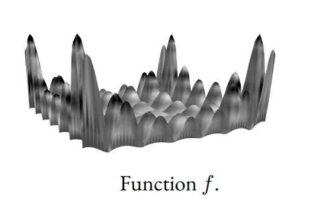
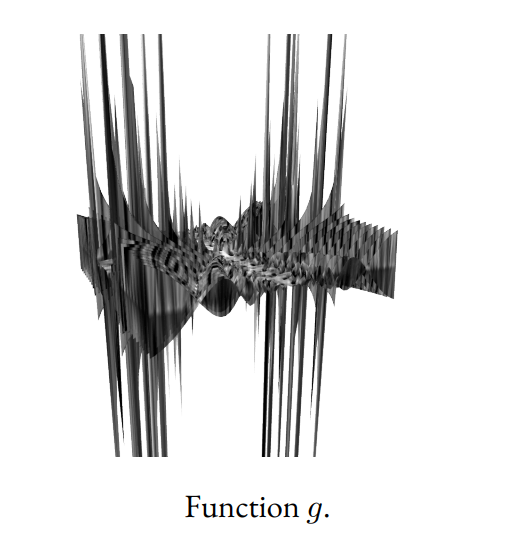

# Finding Global Min and Max Using Particle Swarm Optimization (PSO) Algorithm

## Overview

The Particle Swarm Optimization (PSO) Algorithm is a computational method used to optimize a problem iteratively by improving candidate solutions. In this project, we implement the PSO algorithm using Python to find the global maximum and minimum of two functions, f(x, y) and g(x, y), respectively. The goal is to find points (x, y) such that:

1. For function f(x, y):
   - f(x, y) > 19.2
   - Function: $f(x, y) = |sin(x) * cos(y) * exp(|1 - (√(x^2 + y^2) / π)|)|$
   - Range: -10 ≤ x, y ≤ 10

2. For function g(x, y):
   - g(x, y) < -1.7 × 10^6
   - Function: $g(x, y) = x * sin(π * cos(x) * tan(y)) * sin(y / x) / (1 + cos(y / x))$
   - Range: -100 ≤ x, y ≤ 100
   

## Implementation

### Requirements

- Python
- NumPy
- mpmath (for high-precision arithmetic)

## Code Structure

The code is organized as follows:

- `f(x, y)` and `g(x, y)` functions: These functions represent the target functions that we aim to optimize.

- Particle class: A Python class called `particle` represents individual particles in the PSO algorithm. Each particle has attributes such as position, velocity, fitness value, and personal best (pbest).

- Initialization: The PSO algorithm initializes a set of particles with random positions and velocities.

- Movement: Particles are updated according to the PSO algorithm's movement rules. The global best (gbest) position and fitness are also updated during this phase.

- Iterations: The PSO algorithm iterates until a stopping condition is met. The current best solution and fitness value are printed at regular intervals.

Feel free to explore the code and customize it for your specific optimization tasks.

